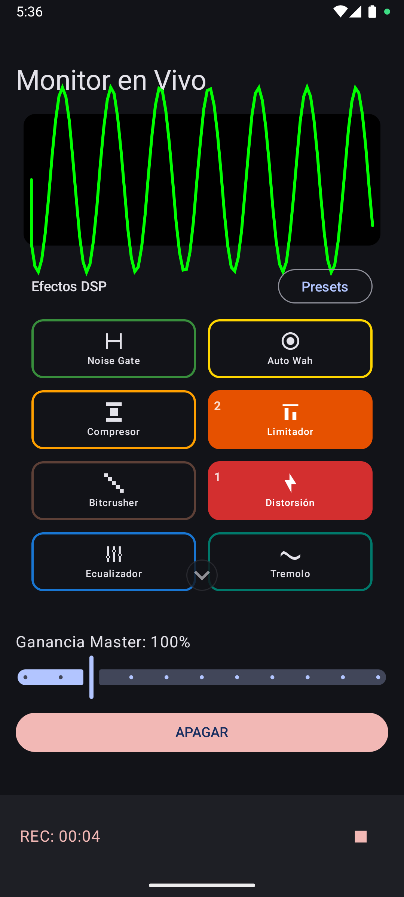
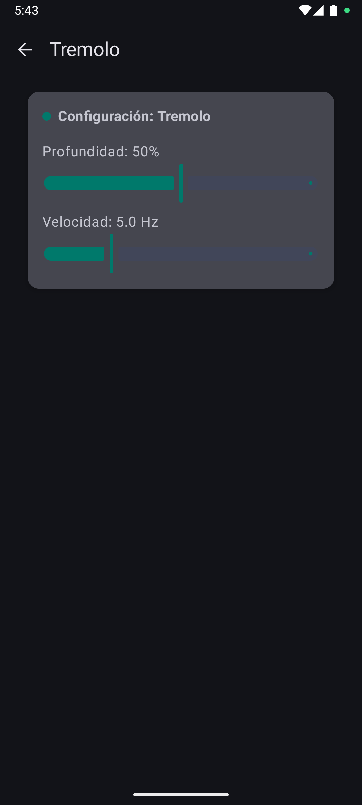
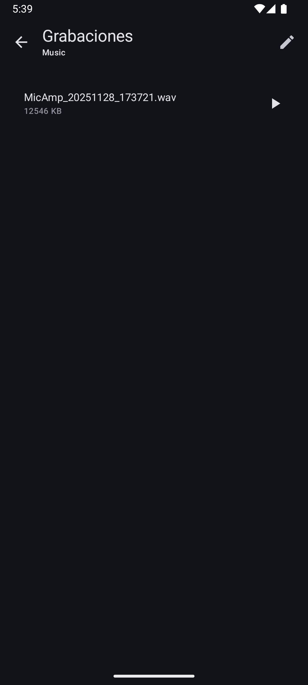

# MicAmp - Procesador de Audio en Tiempo Real

MicAmp es una aplicación Android profesional desarrollada en **Kotlin** y **Jetpack Compose** que transforma tu dispositivo en un potente rack de efectos de audio en tiempo real. Diseñada para músicos (especialmente guitarristas), podcasters y entusiastas del sonido que buscan una solución portátil para procesar su audio con baja latencia.

---

## 📸 Capturas de Pantalla

| Pantalla Principal (Performance) |              Configuración de Efectos               |                   Grabaciones                    |
|:--------------------------------:|:---------------------------------------------------:|:------------------------------------------------:|
|  |  |  |

---

## ✨ Características Principales

### 🎛️ Motor de Audio de Baja Latencia
Procesamiento de audio en tiempo real (Loopback) utilizando las APIs nativas de Android (`AudioRecord` / `AudioTrack`) optimizadas para minimizar el retardo, permitiendo tocar instrumentos en vivo.

### 🔊 Suite de 13 Efectos DSP
MicAmp incluye una colección completa de efectos digitales que puedes combinar libremente:

*   **Dinámica:**
    *   🟢 **Noise Gate:** Silencia la señal cuando no tocas para eliminar ruido de fondo (hum/hiss).
    *   🟠 **Compresor:** Nivela los picos de volumen para un sonido más consistente y con sustain.
    *   🟧 **Limitador:** "Pared de ladrillo" al final de la cadena para evitar distorsión digital desagradable (clipping).
*   **Tono & Filtros:**
    *   🔵 **Ecualizador (EQ):** 6 bandas gráficas para esculpir tu tono (Bajos, Medios, Agudos).
    *   🟡 **Auto Wah:** Filtro envolvente que responde a tu ataque ("quack" funky).
    *   🟤 **Bitcrusher:** Reduce la resolución (bits) para sonidos lo-fi robóticos o industriales.
*   **Saturación:**
    *   🔴 **Distorsión:** Desde un overdrive suave hasta una distorsión agresiva de alta ganancia.
*   **Modulación:**
    *   🟣 **Phaser:** Efecto de barrido de fase psicodélico y espacial.
    *   🟡 **Flanger:** Sonido de "avión jet" metálico mediante retardos muy cortos.
    *   💗 **Chorus:** Duplica y desafina ligeramente la señal para dar amplitud y grosor.
    *   🔵 **Tremolo:** Fluctuación rítmica del volumen.
*   **Espacio & Tiempo:**
    *   🟣 **Delay:** Eco digital con controles de tiempo, retroalimentación (repeticiones) y mezcla.
    *   🔘 **Reverb:** Simulación de reverberación para dar ambiente y profundidad.

### 🔄 Cadena de Efectos Dinámica (Signal Chain)
El orden de los efectos altera drásticamente el resultado final. **MicAmp** utiliza un sistema de ordenamiento inteligente e intuitivo:

> **"Lo último que enciendes es lo último que se procesa"**

*   Al activar un efecto, este se mueve automáticamente al **final** de la cadena de procesamiento.
*   Cada botón activo muestra un **número en la esquina superior izquierda** (1, 2, 3...) indicando su posición exacta en la ruta de la señal.
*   *Ejemplo:* Si activas Distorsión (1) y luego Reverb (2), tendrás un sonido de rock clásico. Si apagas Distorsión y la vuelves a encender, ahora será Reverb (1) -> Distorsión (2), creando un sonido "Shoegaze" sucio.

### 💾 Gestión de Presets
Guarda tus configuraciones favoritas para recuperarlas al instante:
*   Guarda el estado (on/off) de todos los efectos.
*   Guarda todos los parámetros internos (perillas, sliders).
*   **¡Guarda el orden de la cadena!** Tu diseño sonoro se mantiene intacto.

### 🎙️ Grabación y Herramientas
*   **Grabadora WAV:** Captura tus ideas en alta calidad sin compresión.
*   **Visualizador:** Osciloscopio en tiempo real para monitorear la señal de entrada.
*   **Gestión de Archivos:** Accede, reproduce y comparte tus grabaciones desde la app.

---

## 🚀 Guía de Uso Rápida

1.  **Conexión:**
    *   Conecta tu instrumento (vía interfaz USB o adaptador iRig) o usa el micrófono integrado.
    *   **Importante:** Usa auriculares para evitar el acople (feedback) entre el micrófono y los altavoces.
2.  **Configuración Inicial:**
    *   Selecciona tu **Dispositivo de Entrada** (Micrófono/USB) y **Salida** (Auriculares) en los menús desplegables.
    *   Presiona el botón **"ENCENDER"**.
3.  **Aplicando Efectos:**
    *   **Toque simple:** Activa/Desactiva el efecto. Observa cómo cambia el número de orden.
    *   **Mantener presionado:** Abre la pantalla de **Ajustes** de ese efecto específico para mover perillas y sliders.
4.  **Guardar Preset:**
    *   Toca el botón "Presets".
    *   Escribe un nombre y guarda tu configuración actual.

---

## 🛠️ Tecnologías y Requisitos

*   **Requisitos:** Android 8.0 (Oreo) o superior. Se recomienda Android 10+ para mejor latencia.
*   **Lenguaje:** Kotlin 100%
*   **UI:** Jetpack Compose (Material 3)
*   **Arquitectura:** MVVM (Model-View-ViewModel)
*   **Audio:** Java Audio API (AudioRecord/AudioTrack) con procesamiento de arrays en hilos dedicados.

---
*Desarrollado 95% con Gemini con una idea y ganas de jugar un rato le faltaria jugar con el estilo y darle onda pero va bastante bien
